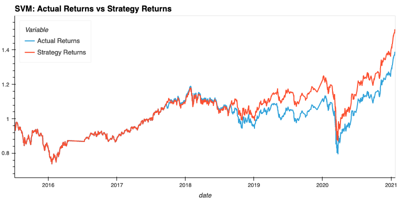
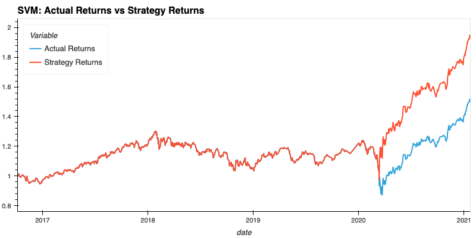
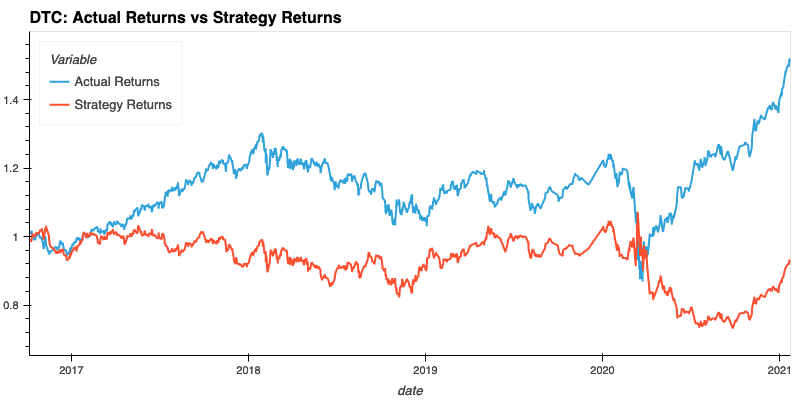
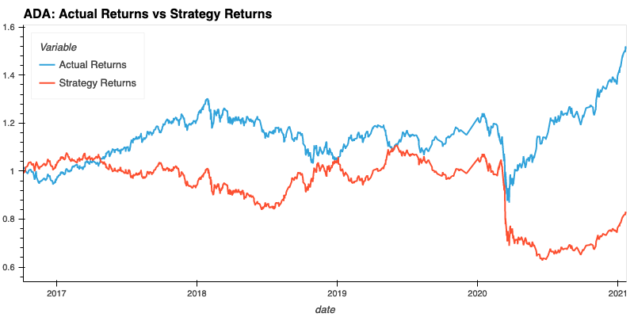

#  REPO NAME

Repo description

---

## Evaluation Report

For this report, express your final conclusions and analysis.
Support your findings by using the PNG images that you created.

### Baseline Trading Algorithm

The baseline trading algorithm is about 56% accurate at predicting buy signals according to the classification reports (detailed below). However the graph of the actual returns vs. strategy returns show the trading strategy winning in the long run.

**Baseline Algorithm Classification Report**

                  precision    recall  f1-score   support
            -1.0       0.43      0.04      0.07      1804
             1.0       0.56      0.96      0.71      2288

        accuracy                           0.55      4092
       macro avg       0.49      0.50      0.39      4092
    weighted avg       0.50      0.55      0.43      4092

### Tuning the Trading Algorithm - Adjusting the Training Period

Below you'll find classification reports after re-training the data using 6, 9, 12, 15, and 18-month periods of training data.

**6 months**

				  precision    recall  f1-score   support
			-1.0       0.44      0.02      0.04      1732
			 1.0       0.56      0.98      0.71      2211

		accuracy                           0.56      3943
	   macro avg       0.50      0.50      0.38      3943
	weighted avg       0.51      0.56      0.42      3943

**9 months**

				  precision    recall  f1-score   support
			-1.0       0.45      0.31      0.37      1616
			 1.0       0.57      0.70      0.63      2088

		accuracy                           0.53      3704
	   macro avg       0.51      0.51      0.50      3704
	weighted avg       0.52      0.53      0.51      3704

**12 months**

				  precision    recall  f1-score   support
			-1.0       0.00      0.00      0.00      1497
			 1.0       0.56      1.00      0.72      1931

		accuracy                           0.56      3428
	   macro avg       0.28      0.50      0.36      3428
	weighted avg       0.32      0.56      0.41      3428

**15 months**

				  precision    recall  f1-score   support
			-1.0       0.00      0.00      0.00      1484
			 1.0       0.56      1.00      0.72      1921

		accuracy                           0.56      3405
	   macro avg       0.28      0.50      0.36      3405
	weighted avg       0.32      0.56      0.41      3405

**18 months**

				  precision    recall  f1-score   support

			-1.0       0.75      0.00      0.00      1430
			 1.0       0.56      1.00      0.72      1843

		accuracy                           0.56      3273
	   macro avg       0.66      0.50      0.36      3273
	weighted avg       0.64      0.56      0.41      3273

18 months appears to be a good timeframe for training on the initial dataset as both the precision for 1.0 and -1.0 is the highest at 56% and 75% respectively.

### Tuning the Trading Algorithm - Adjusting the Slow / Fast SMAs

By adjusting the Slow / Fast SMAs we are able to improve the -1.0 precision from 75% to 86%. When comparing the Actual vs Strategy Returns it appears these SMAs are superior to past values, but this could be due purely to the benefit of a single (or small handful) of trading decisions in March / April 2020.

**Improved Algorithm Classification Report**

				  precision    recall  f1-score   support

			-1.0       0.86      0.00      0.01      1430
			 1.0       0.56      1.00      0.72      1843

		accuracy                           0.56      3273
	   macro avg       0.71      0.50      0.36      3273
	weighted avg       0.69      0.56      0.41      3273

### Using a new Model to Improve the Trading Algorithm

## Technologies

The stable version of this project can be run on Windows, Mac OS, or Linux as long as the user's 
environment has the following:
- python #.#
- framework
- names
- here

---

## Installation Guide

You have a few options to install this application on your computer, two popular options are:

1. Download a ZIP of this repositories files 
[here](url-to-zip)
     example: (https://github.com/Warp-9000/uw-fintech-2022-module01-challenge/archive/refs/heads/main.zip).

2. [Fork this respository](https://docs.github.com/en/get-started/quickstart/fork-a-repo "Fork a Repo - 
GitHub Docs") to your github account.

After forking the respository you can use `git clone 
your-username@domain.com:your-git-username/uw-fintech-2022-module01-challenge.git` 
to download a copy of the forked respository to your computer.

Forking has the added benefit of enabling your to easily keep your copy of the 
application up-to-date should any changes or improvements be made in the future.

---

## Usage

***Please note:*** *these usage instructions assume you have setup an environment where
the python version, libraries, and frameworks listed in [Technologies](#Technologies) are installed.*

1. Navigate to the root folder of your repository.
2. Run the application by ...
3. Enter any information requested by the application.

An example of the application running:

---

## Contributors

Thanks!

---

## License

This project is licensed under ... Please see the LICENSE file 
[here](https://github.com/Warp-9000/uw-fintech-2022/blob/main/Module-02/Challenge/loan_qualifier_app/LICENSE).
